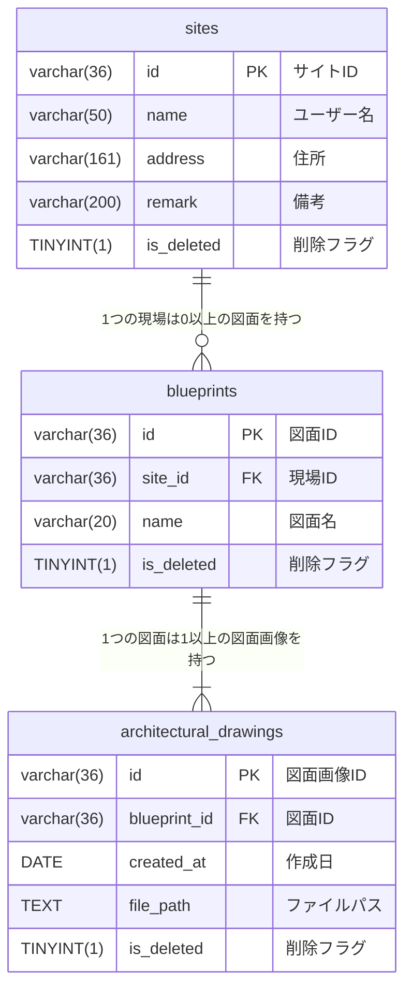

# 図面管理アプリ

## はじめに

こちらのリポジトリはJava,JavaScriptを学習中の私が作成した建築図面管理アプリのプロジェクトです。    
建設業階で働く現場監督、職人の方の業務支援を目的としており、建築図面の管理方法で発生する課題の解決を目的として開発しています。    
本リポジトリの利用に関するトラブル等について、開発者は一切の責任を負いかねますのでご了承ください。

## コンセプト

前職は建設企業で職人として働いておりました。     
建築図面の管理がパソコンのフォルダ上や紙面で行われており、

- ファイル名が乱雑に記述され、最新の図面がわからず、古い図面を渡され作業を進めていた。
- 提携業者へのFaxをし忘れにより、図面が渡っていなかった。

などのトラブルが発生していました。      
そうした課題を解決したいと考え、現場監督や責任者が図面の管理をしやすく、また現場の職人にすぐにシェアできるようにと思い開発をしました。    
直感的に使えるようシンプルなUIを採用し、現場での業務の効率化を図ります。

## 使用技術

バックエンド:  

フロントエンド:       

インフラ:      

## APIエンドポイント一覧

| HTTPメソッド | エンドポイント | 機能 |
| ---- | ---- | ---- |
| HEAD | /sites | 現場情報の存在を確認 |
| GET | /sites | 現場情報一覧の取得 |
| GET | /sites/{siteId} | 現場情報一件の取得(ID指定) |
| GET | /sites | 現場情報一覧の取得 |
| GET | /sites/{siteId}/blueprints | 現場IDに該当する図面情報一覧の取得 |
| POST | /sites | 現場情報の追加 |
| PUT | /sites/{siteId} | 現場情報の更新 |
| DELETE | /sites/{siteId} | 現場情報の削除 |
| GET | /blueprints/{blueprintId} | 図面情報の取得(ID指定) |
| POST | /blueprints | 図面情報の追加 |
| PUT | /blueprints | 図面情報の更新 |
| DELETE | /blueprints | 図面情報の削除 |
| POST | /architecturalDrawings | 図面画像情報の追加 |

## ER図

## テスト実行結果

JUnit5による単体テストを実装しています。

- テストは網羅率が100％になるように実装
- Controller層：バリデーションチェックが行われ適切なAPIが返却されることを保証
- Service層：ビジネスロジックに適したデータが返却されることを保証
- Repository層：h2を導入しDBに対してSQLが正常に作動することを保証

## 工夫したところ

- 日付を選択することで図面画像が切り替えられること    
  建築図面はお客様の要望や設計の修正などにより変更が加えられることが多々あります。過去の図面情報も閲覧できるように、日付を切り替えることで過去の画像が表示できるように設計しています。

- UIをシンプルで直感的にわかるようにすること  
  ユーザーが扱いやすいように、直感的でわかりやすいUIで構築することを意識しました。現在どこのページを閲覧しているかわかるようにタブの色を変更したり、ボタンの表示をわかりやすくしたりしました。

- 閲覧用のURLを作成したこと  
  管理している図面情報を現場の職人にすぐに渡せるように閲覧用URLを発行できるように設計しました。図面の変更があってもオンライン上で即座に職人とすり合わせができるようにしました。

## 苦労したところ

- 画像のCRUD処理   
  建築図面を扱うシステムですので画像の取り扱いが必須でした。しかし
  画像処理に関してはスクールで学習していなかったので一から調べて実装しました。    
  画像データの保存・表示方法について自分で調べ、また講師の方にも相談しながら実装したことで、画像のCRUD処理ができたことは大きな学びにつながりました。

- staticメソッド・MultipartFileのテスト実装
  こちらもスクールで学習していなかった内容でしたのでかなり苦戦しました。  
  今まで習った内容とは少し異なる記述方法があるのだと知り、エラーにぶつかりながら何度も調べてテストが無事通った時は嬉しかったです。

- Dockerの導入    
  ローカルの開発ではMySQLをDocker上で管理していました。少しの記述ミスでエラーになってしまい、思うような結果が得られないことが何度もありました。   
  一つずつエラーメッセージを解読し、自力で想定通りの動きを実装できたことは大きな成長になりました。

## 今後の改善案

- 認証機能の実装
- 多対多の管理者テーブルを作成し、管理者ごとに現場情報を管理
- 現場リスト・図面リストの並べ替え機能
- 並び順テーブルを作成し、リストの順番を管理するように修正

