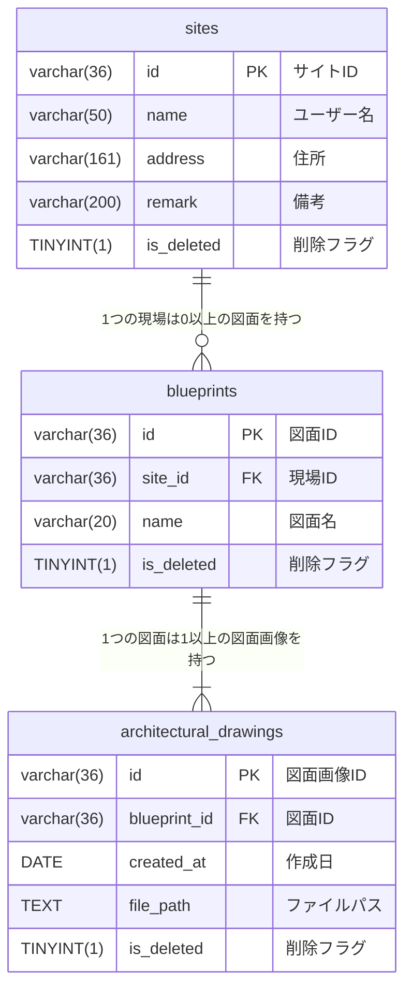

# 図面管理アプリ

## はじめに

こちらのリポジトリはJava,JavaScriptを学習中の私が作成した建築図面管理アプリのプロジェクトです。    
建設業階で働く現場監督、職人の方の業務支援を目的としており、建築図面の管理方法で発生する課題の解決を目的として開発しています。    
本リポジトリの利用に関するトラブル等について、開発者は一切の責任を負いかねますのでご了承ください。

## コンセプト

前職は建設企業で職人として働いておりました。     
建築図面の管理がパソコンのフォルダ上や紙面で行われており、

- ファイル名が乱雑に記述され、最新の図面がわからず、古い図面を渡され作業を進めていた。
- 提携業者へのFaxをし忘れにより、図面が渡っていなかった。

などのトラブルが発生していました。      
そうした課題を解決したいと考え、現場監督や責任者が図面の管理をしやすく、また現場の職人にすぐにシェアできるようにと思い開発をしました。    
直感的に使えるようシンプルなUIを採用し、現場での業務の効率化を図ります。

## 始め方
https://blueprints-management.com/

「管理画面に移動」をクリックします    
（実際の図面を権利の都合上使用できないため、ChatGPTで画像サンプルを作成しています）


## 機能一覧

### 現場の追加

左メニューの「追加」ボタンから現場を新しく追加することができます。

https://github.com/user-attachments/assets/31b24068-ea5d-458a-905a-dba3f824930b

### 現場の修正

「修正」ボタンで現場情報を修正することができます。

https://github.com/user-attachments/assets/73fd25b2-5d80-47b5-8121-e817203ac18d

### 図面の追加

右メニューの「追加」ボタンから図面を新しく追加することができます。

https://github.com/user-attachments/assets/af8c220c-4fe9-4b37-8753-eb65e8123ae6

### 図面の更新

「更新」ボタンで図面を更新することができます。
また日付を変更することで古い図面も表示することが可能です。

https://github.com/user-attachments/assets/8786ca7a-3ff0-4435-87dc-fa07fd761d12

### 図面名の修正

「修正」ボタンで図面名を修正することができます。

https://github.com/user-attachments/assets/66ac05df-2134-42d4-a67d-3e3f214834bd

### 図面の共有

「共有」ボタンを押すと、閲覧専用のURLがクリップボードにコピーされます。
URLを別の人に渡すことで閲覧のみ可能なページを開くことが可能となります。

https://github.com/user-attachments/assets/82d96032-286e-4880-8ee4-b2b461023824

### 図面の削除

「削除」ボタンで現在選択されている日付の図面画像を削除することができます。
図面画像が存在しなくなった場合、現場情報に遷移されます。

https://github.com/user-attachments/assets/8730395a-1ed8-43fb-a8c3-299beed0c794

### 現場の削除

「削除」ボタンで現場を削除することができます。

https://github.com/user-attachments/assets/eff1c08b-0135-4037-a2e3-0ac3171e3596

### タブで選択

複数データが存在する場合、タブを選択することで画面が遷移されます。

https://github.com/user-attachments/assets/97fe046b-faa8-4942-8045-3ab40834d196

## 使用技術

バックエンド: <br>


フロントエンド:       


インフラ:      


## APIエンドポイント一覧

| HTTPメソッド | エンドポイント | 機能 |
| ---- | ---- | ---- |
| HEAD | /sites | 現場情報の存在を確認 |
| GET | /sites | 現場情報一覧の取得 |
| GET | /sites/{siteId} | 現場情報一件の取得(ID指定) |
| GET | /sites | 現場情報一覧の取得 |
| GET | /sites/{siteId}/blueprints | 現場IDに該当する図面情報一覧の取得 |
| POST | /sites | 現場情報の追加 |
| PUT | /sites/{siteId} | 現場情報の更新 |
| DELETE | /sites/{siteId} | 現場情報の削除 |
| GET | /blueprints/{blueprintId} | 図面情報の取得(ID指定) |
| POST | /blueprints | 図面情報の追加 |
| PUT | /blueprints | 図面情報の更新 |
| DELETE | /blueprints | 図面情報の削除 |
| POST | /architecturalDrawings | 図面画像情報の追加 |

## ER図



## インフラ構成図


## テスト実行結果

JUnit5による単体テストを実装しています。

- Controller層：バリデーションチェックが行われ適切なAPIが返却されることを保証
- Service層：ビジネスロジックに適したデータが返却されることを保証
- Repository層：h2を導入しDBに対してSQLが正常に作動することを保証


## 工夫したところ、苦労したところ

### S3を使用して画像を保存したこと    
  S3や画像の取り扱いをスクールで習っていなかったのですが、建築図面を扱うアプリケーションのため実装にトライしました。    
  ローカルで開発するときにどのように画像を扱うか調べてみたところ、MultipartFileクラスがあることを知りました。    
  フロントのフォームから送された画像データをMultipartFileで受け取りbyte[]に変換し、static/images/フォルダに保管。       
  また、ファイルパスはMySQL上に保存するように設計しました。

  デプロイ後ではアップロード先をS3に変更。最初はcredentialsでキーを扱っていました。    
  しかし講師に相談したところ、S3へのアクセス権限があるロールを作成するやり方がいいと教えていただき、EC2にロールを付与してS3へアクセスするように変更しました。

  最初は画像のアップロードをどのようにしていけばいいかわからず、一から調べながら実装していきました。    
  ・画像データとファイルパスを分けて保存する方法がわからない    
  ・S3へのアクセス方法を公式ドキュメントで模索    
  ・アップロード自体はできたがフロント側で表示されない    

  などさまざまな壁がありましたが、一つ一つクリアしていき、想定通りの動作が実現できました。

    ```
    @Transactional
    public String addBlueprint(AddBlueprintRequest request) throws IOException {
        MultipartFile imageFile = request.getImageFile();
        String imageFileName = imageFile.getOriginalFilename();
        byte[] content = imageFile.getBytes();
    
        Blueprint blueprint = Blueprint.formBlueprint(request);
        String filePath = blueprint.getId() + "/" + imageFileName;
    
        ArchitecturalDrawing architecturalDrawing = ArchitecturalDrawing.formArchitecturalDrawingFromBlueprintRequest(
                request, blueprint.getId(), filePath);
    
        blueprintRepository.addBlueprint(blueprint);
        architecturalDrawingRepository.addArchitecturalDrawing(architecturalDrawing);
    
        PutObjectRequest objectRequest = PutObjectRequest.builder()
                .bucket(bucketName).key(filePath).build();
    
        try {
            s3.putObject(objectRequest, RequestBody.fromBytes(content));
        } catch (Exception e) {
            throw new FailedToPutObjectException(ErrorMessage.FAILED_TO_PUT_OBJECT.getMessage());
        }
    
        return blueprint.getId();
    }
    ```

### dockerの導入
  ローカル環境ではMySQLをdockerで構築し、データベースのやり取りを行いました。    
  dockerは現在の開発環境では必須だと思い学習。    
  調べながら実装していきましたがちょっとした記述ミスでエラーが発生してしまうため、想定通りの動きができるまで時間がかかりました。    
  
  発生したエラーをよく読み、内容を検索しながら修正していったことで無事にJavaとMySQLが繋がることができました。    
  docker上のデータベースの情報をCRUD処理できた時は自分の成長を実感しとても嬉しかったです。    
  
  ```
  services:
  db:
    platform: linux/x86_64
    image: mysql:8.0.42-debian
    container_name: blueprints_db
    environment:
      MYSQL_ROOT_PASSWORD: rootroot
      MYSQL_DATABASE: BlueprintsManagement
    command: mysqld --character-set-server=utf8mb4 --collation-server=utf8mb4_unicode_ci
    volumes:
      - ./docker/db/data:/var/lib/mysql
      - ./docker/db/sql:/docker-entrypoint-initdb.d
      - ./docker/db/my.cnf:/etc/mysql/conf.d/my.cnf
    ports:
      - '3307:3306'
  ```

## 今後の改善案

- 認証機能の実装
- 多対多の管理者テーブルを作成し、管理者ごとに現場情報を管理
- 現場リスト・図面リストの並べ替え機能
- 並び順テーブルを作成し、リストの順番を管理するように修正

